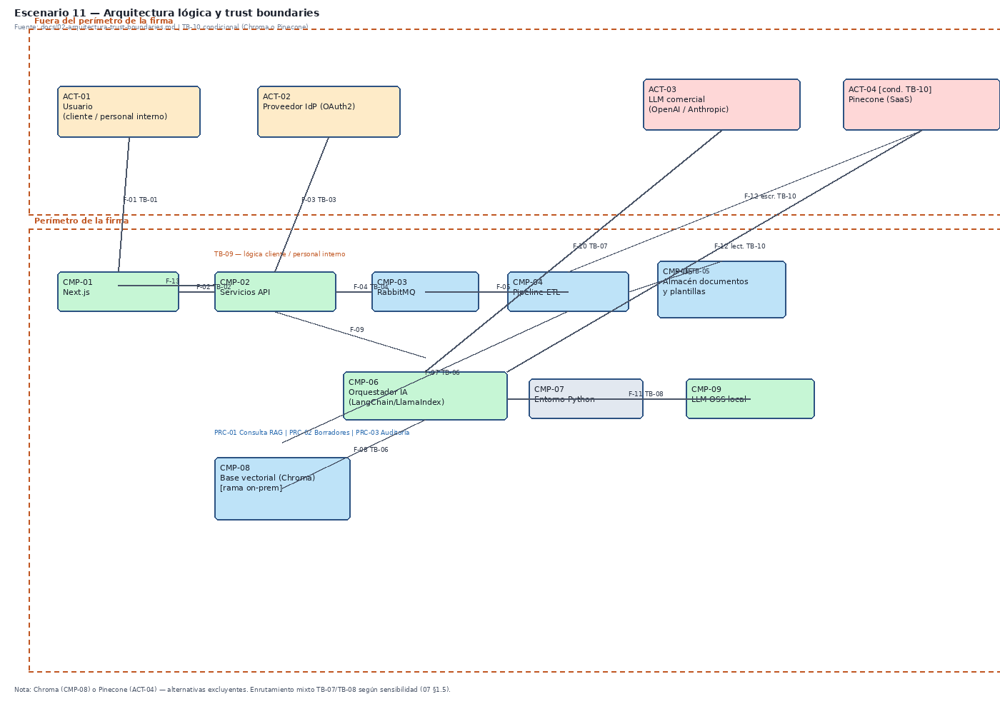

# Arquitectura y trust boundaries

**Escenario:** 11 — Plataforma de Asistencia Legal basada en IA Generativa (RAG).

**Fuentes:** enunciado del escenario, [`01-inventario-activos.md`](01-inventario-activos.md).

**Alcance:** arquitectura lógica de referencia y fronteras de confianza para threat modeling. No incluye STRIDE, DREAD ni mitigaciones.

---

## Diagrama de arquitectura

**Figura 1.** Arquitectura de referencia y límites de confianza.

Los usuarios (clientes y personal interno) acceden por Internet al frontend Next.js. La API centraliza autorización y enruta hacia RabbitMQ/ETL, almacén de documentos, orquestador de IA, base vectorial (Chroma on-prem o Pinecone SaaS) y LLMs (comercial en la nube o local para datos sensibles). La autenticación es OAuth2 federada vía IdP externo.

---

## Actores del sistema

| Actor | Descripción | Privilegios |
|-------|-------------|-------------|
| Cliente externo | Usuario de la firma que carga documentos y consulta | Limitados a su tenant y casos |
| Personal interno | Abogados y staff que operan la plataforma | Altos según rol |
| Proveedor IdP | Emite tokens OAuth2 | Tercero de confianza |
| Proveedor LLM / vectorial | Servicios cloud (OpenAI, Anthropic, Pinecone) | Tercero según configuración |
| Atacante externo | Actor malicioso sin acceso legítimo | Ninguno |

---

## Trust boundaries

### TB-01 — Usuario / Internet ↔ Frontend (Next.js)

Separa el dispositivo del usuario del software bajo control de la firma. Toda carga documental, consulta y visualización de resultados cruza esta frontera.

**Activos:** documentos, consultas, respuestas RAG, borradores, tokens de sesión.

### TB-02 — Frontend ↔ API / servicios de aplicación

Separa código en el navegador de la lógica de negocio y autorización en servidor. Es donde se validan permisos y se preparan trabajos hacia cola y orquestador.

**Activos:** mismos de TB-01 más plantillas y metadatos de API.

### TB-03 — Plataforma ↔ Terceros (IdP, LLM comercial, Pinecone)

Separa el perímetro de la firma de proveedores externos. Incluye OAuth2, envío de contexto a LLM en la nube y, si aplica, base vectorial SaaS.

**Activos:** identidades, contexto RAG enviado a LLM, embeddings en Pinecone.

### TB-04 — API / Orquestador ↔ Persistencia (almacén, vector DB, LLM local)

Separa la capa de aplicación de los repositorios y del modelo local. Protege contratos almacenados, índice vectorial y rutas de inferencia on-prem.

**Activos:** documentos, índice vectorial, borradores, resultados de auditoría.

---

## Trazabilidad

| Documento | Relación |
|-----------|----------|
| [`03-analisis-stride.md`](03-analisis-stride.md) | Amenazas sobre componentes y fronteras |
| [`../diagrams/attack-flow.png`](../diagrams/attack-flow.png) | Escenario de ataque hipotético |
